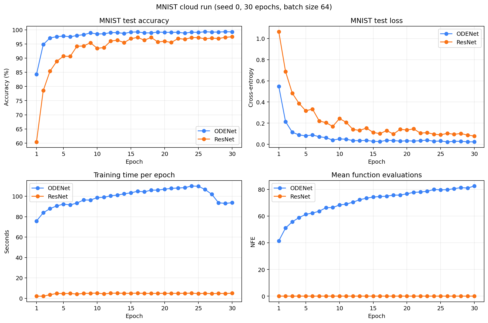

# Neural ODE 核心实验复现

本项目使用 PyTorch 和 [`torchdiffeq`](https://github.com/rtqichen/torchdiffeq)，复现论文 *Neural Ordinary Differential Equations*（NeurIPS 2018）的核心思想与代表性实验。重点不是逐项复制原论文的全部大规模任务，而是在可控算力下验证连续深度模型、数值求解器和伴随灵敏度方法的主要特征。

完整方法、实验分析与局限性见 [中文复现报告](report/neural_ode_report.md)。

## 复现内容

- 二维 Spiral 连续动力系统拟合；
- MNIST 上参数量接近的 ODENet 与 ResNet 公平对比；
- 三个随机种子的短训练统计；
- seed=0 的 30-epoch 收敛实验；
- Direct Backpropagation 与 Adjoint Method 的时间/显存对比；
- ODE 求解容差对 NFE（函数评估次数）的影响。

MNIST 使用原始 IDX 文件加载器，不依赖 `torchvision`。训练默认采用 FP32，以减少低显存设备上的数值不稳定问题。

## 主要结果

### MNIST 30-epoch 收敛实验

实验使用相同数据、batch size、Adam 学习率和随机种子；ODENet 与 ResNet 参数量分别为 19,274 和 19,338。

| 模型 | 最佳测试准确率 | 第 30 轮测试准确率 | 平均训练耗时/轮 | 峰值显存 |
|---|---:|---:|---:|---:|
| ODENet | **99.32%**（epoch 29） | 99.27% | 99.16 s | 766.35 MiB |
| ResNet | **97.54%**（epoch 30） | 97.54% | 4.59 s | 88.37 MiB |



完整 60 条逐轮指标、运行配置和结果说明保存在 [`outputs/mnist-cloud-30`](outputs/mnist-cloud-30)。该实验在 NVIDIA RTX 5090 32GB 上运行，只有一个随机种子，因此用于观察收敛趋势，不替代多随机种子统计。

### 其他实验

| 实验 | 结果摘要 | 文件 |
|---|---|---|
| Spiral | 300 epochs，最终 MSE 约 `9.04e-4` | [`outputs/spiral-baseline`](outputs/spiral-baseline) |
| MNIST 三 seed、5 epochs | ODENet 最佳准确率 `98.00% ± 0.40%`；ResNet `92.35% ± 1.21%` | [`outputs/mnist-fair-summary.md`](outputs/mnist-fair-summary.md) |
| Direct vs. Adjoint | Adjoint 峰值显存约 139 MiB，Direct 约 397 MiB | [`outputs/adjoint-summary.md`](outputs/adjoint-summary.md) |
| ODE 容差 | `rtol=1e-3/1e-5/1e-7` 时 NFE 约为 `38.0/38.9/39.2` | [`outputs/tolerance-summary.md`](outputs/tolerance-summary.md) |

短训练中的 ResNet 尚未充分收敛，因此不能只依据三 seed、5-epoch 结果评价模型上限。30-epoch 实验将 ResNet 的最终准确率提高到 97.54%，同时 ODENet 仍高出约 1.73 个百分点，但训练代价明显更大。

## 项目结构

```text
.
├── src/
│   ├── models.py                    # ODENet、ODEBlock 与 ResNet 基线
│   ├── mnist_data.py                # MNIST IDX 下载与读取
│   ├── mnist_experiment.py          # 分类、Adjoint 与容差实验
│   ├── plot_mnist_comparison.py     # 训练曲线生成
│   └── spiral.py                    # 二维连续动力系统实验
├── outputs/                         # 配置、逐轮指标、汇总与图片
├── report/neural_ode_report.md      # 完整中文报告
└── requirements.txt
```

## 环境安装

建议使用 Python 3.9 或更高版本。先根据本机 CUDA 环境安装 PyTorch，再安装其余依赖：

```bash
python -m venv .venv

# Linux / macOS
source .venv/bin/activate

# Windows PowerShell
.venv\Scripts\Activate.ps1

python -m pip install -r requirements.txt
```

项目依赖 `torch`、`torchdiffeq`、NumPy 和 Matplotlib。若本机已存在可用的 Conda/PyTorch 环境，可以直接在该环境中安装 `requirements.txt`。

## 运行实验

### Spiral

```bash
python -m src.spiral --epochs 300 --output-dir outputs/spiral
```

### MNIST：ODENet 与 ResNet

第一次运行时会自动下载 MNIST：

```bash
python -m src.mnist_experiment \
  --model both --epochs 30 --batch-size 64 --lr 1e-3 \
  --seed 0 --output-dir outputs/mnist
```

PowerShell 可以将上述命令写在一行，或使用反引号替代反斜杠续行。

### Adjoint 与容差实验

```bash
python -m src.mnist_experiment \
  --model odenet --adjoint --epochs 3 --batch-size 64 \
  --tolerances 1e-3 1e-5 1e-7 --output-dir outputs/tolerance
```

### 快速运行检查

```bash
python -m src.spiral --epochs 2 --n-points 64 --output-dir outputs/smoke
python -m src.mnist_experiment \
  --model odenet --epochs 1 --max-train-batches 2 \
  --max-test-batches 1 --output-dir outputs/smoke-mnist
```

每次分类实验都会输出 `metrics.csv` 和 `config.json`。可使用以下命令生成对比曲线：

```bash
python -m src.plot_mnist_comparison \
  outputs/mnist/metrics.csv \
  --output outputs/mnist/training_curves.png
```

## 与原论文的对应关系

- `src/spiral.py` 展示神经网络向量场学习连续动力系统；
- `src/models.py` 中的 `ODENet` 将残差变换替换为数值 ODE 求解；
- `odeint_adjoint` 分支对应论文的伴随灵敏度方法；
- tolerance sweep 展示误差容差与计算量之间的权衡；
- 轻量 ResNet 仅作为参数量匹配的项目内基线，不代表标准 ResNet 的最佳性能。

## 复现范围

本仓库完成的是可在个人电脑或单张 GPU 上运行的代表性复现，没有覆盖原论文中的连续归一化流和潜变量时间序列模型，也不声称逐数值复刻论文的全部表格。运行时间和峰值显存依赖 GPU、PyTorch/CUDA 版本及系统环境，跨硬件数据不应直接比较。

## 参考资料

- Chen et al., *Neural Ordinary Differential Equations*（2018）：[NeurIPS 正式发表页](https://proceedings.neurips.cc/paper/2018/hash/69386f6bb1dfed68692a24c8686939b9-Abstract.html) · [arXiv 预印本](https://arxiv.org/abs/1806.07366)
- [`torchdiffeq` 官方实现](https://github.com/rtqichen/torchdiffeq)
