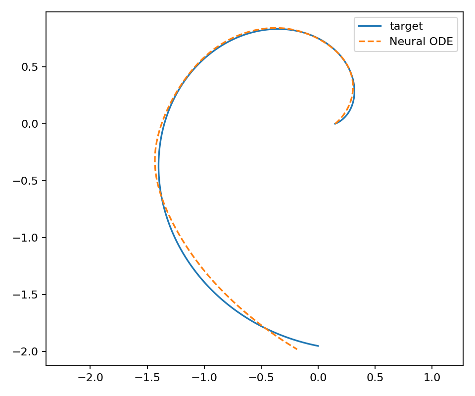
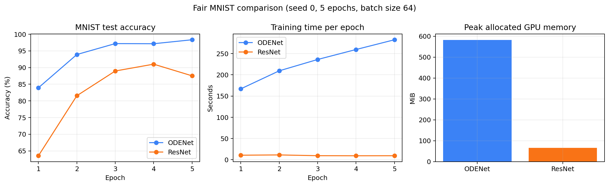

# Neural Ordinary Differential Equations 核心实验复现报告

## 摘要

传统深度神经网络通常由有限个离散层组成，而 Neural Ordinary Differential Equations（Neural ODE）将隐藏状态的变化表示为由神经网络参数化的常微分方程，并使用数值 ODE 求解器计算网络输出。本项目基于 PyTorch 与 `torchdiffeq`，复现 Neural ODE 的三个核心现象：连续深度动力系统拟合、ODE-Net 图像分类，以及求解方式和误差容差带来的计算代价变化。实验首先在二维 Spiral 数据上验证模型学习连续动力系统的能力，随后在 MNIST 上构建参数量相近的 ODENet 与 ResNet 基线，并使用三个随机种子进行公平比较。此外，本项目还比较了直接反向传播与伴随灵敏度方法，并考察不同相对容差对函数评估次数的影响。三次 MNIST 实验中，ODENet 的最佳测试准确率为 `98.00% ± 0.40%`，ResNet 为 `92.35% ± 1.21%`。与此同时，ODENet 的训练时间和显存开销明显更高。结果说明，连续深度模型在该轻量任务上具有较强的拟合能力，但其实际效率高度依赖数值求解器、误差容差和训练轨迹。

**关键词：** Neural ODE；连续深度网络；残差网络；伴随灵敏度；数值求解器；MNIST

## 1. 研究背景

残差网络通过跳跃连接将隐藏状态更新写成

$$
\mathbf{h}_{k+1}=\mathbf{h}_{k}+f_k(\mathbf{h}_k;\theta_k).
$$

这一形式与常微分方程的欧拉离散化相似。Chen 等人在 2018 年提出 Neural ODE：当网络层数不断增加、相邻层间的变化逐渐减小时，可以将离散层索引推广为连续变量，并使用神经网络描述隐藏状态的导数。模型不再显式指定每个残差层，而是把从输入状态到输出状态的变换交给数值 ODE 求解器完成。

原论文展示了连续深度残差网络、连续归一化流和连续时间序列模型等应用。本项目受到本地 RTX 3050 Laptop 4GB 硬件和复现工作量限制，重点复现最能体现 Neural ODE 基本思想的 Spiral 动力系统、MNIST 分类、伴随法和容差实验，不声称逐项复刻原论文的所有生成模型与时间序列实验。

## 2. Neural ODE 原理

### 2.1 从离散残差层到连续动力系统

Neural ODE 使用如下微分方程描述隐藏状态：

$$
\frac{d\mathbf{h}(t)}{dt}=f_\theta(\mathbf{h}(t),t),
$$

其中， $\mathbf{h}(t)$ 是连续时间下的隐藏状态， $f_\theta$ 是由神经网络参数化的向量场。给定初始状态 $\mathbf{h}(t_0)$，输出状态为

$$
\mathbf{h}(t_1)=\mathbf{h}(t_0)+
\int_{t_0}^{t_1}f_\theta(\mathbf{h}(t),t)\,dt.
$$

实际程序无法直接计算该积分，因此需要调用数值求解器。与固定层数的 ResNet 不同，自适应 ODE 求解器会根据当前状态和误差要求决定计算位置与步数。数学模型是连续的，但计算机仍通过有限次函数评估近似求解。

### 2.2 数值求解器、容差与 NFE

本项目采用 Dormand–Prince 五阶自适应方法（Dopri5），积分区间为 $[0,1]$。相对误差容差 `rtol` 和绝对误差容差 `atol` 控制求解精度。容差越严格，求解器通常需要采用更小的步长并进行更多次函数计算。

本项目使用 NFE（Number of Function Evaluations）表示向量场网络 $f_\theta$ 的调用次数。NFE 可以理解为 ODENet 的隐式计算深度，但它不是预先固定的网络层数。同一模型在不同训练阶段、不同输入或不同随机种子下，都可能产生不同 NFE。

### 2.3 梯度计算与伴随灵敏度方法

直接反向传播会保留 ODE 求解过程中的计算图，因此实现简单，但显存会随着内部计算增加。伴随灵敏度方法定义伴随状态

$$
\mathbf{a}(t)=\frac{\partial L}{\partial \mathbf{h}(t)},
$$

并通过反向求解增广 ODE 计算损失对状态和模型参数的梯度。该方法不需要保存正向求解的全部中间状态，因此能降低显存占用；代价是反向阶段需要额外进行 ODE 求解，实际训练速度可能下降。

## 3. 复现方法

### 3.1 软件与硬件环境

实验在 Windows 环境中完成，使用 NVIDIA GeForce RTX 3050 Laptop GPU（4GB 显存）。Python 环境位于 `D:\anaconda3\envs\bishe`，主要依赖如下：

- Python 3.9.21；
- PyTorch 2.2.1+cu118；
- torchvision 0.17.1+cu118；
- torchdiffeq 0.2.5；
- NumPy、SciPy 与 Matplotlib。

全部实验使用 FP32。项目代码和原始结果保存在 GitHub 仓库 `superbaolong/neural-ode-reproduction`。

### 3.2 Spiral 动力系统实验

Spiral 实验使用神经网络参数化二维状态的时间导数，通过 ODE 求解器预测状态轨迹，并最小化预测轨迹与目标轨迹之间的均方误差。该实验用于确认模型、求解器和梯度传播能够正常协同工作，也是 Neural ODE 连续动力系统思想的直观展示。

### 3.3 MNIST 数据集

MNIST 包含 60,000 张训练图像和 10,000 张测试图像，每张图像为 `28×28` 的灰度手写数字，标签为 0 至 9。本项目直接读取原始 IDX 文件，并将像素归一化为浮点数。

### 3.4 ODENet 与 ResNet 基线

ODENet 首先使用卷积、GroupNorm、ReLU 和平均池化将输入映射到 32 个通道，随后使用一个 ODEBlock 进行连续状态变换。向量场由两个 `3×3` 卷积、GroupNorm 和 Tanh 激活组成。ODEBlock 使用 Dopri5，`rtol=1e-3`、`atol=1e-5`，最后通过全局平均池化和线性层输出十个类别。

ResNet 基线使用相同通道数，并由卷积、GroupNorm、ReLU、一个残差块、平均池化和分类头组成。ODENet 和 ResNet 的参数量分别为 19,274 和 19,338，差异仅为 64 个参数，从而尽量避免模型规模对比较结果造成影响。

### 3.5 训练设置

MNIST 公平对比的统一设置如下：

| 项目 | 设置 |
|---|---|
| Epoch | 5 |
| Batch size | 64 |
| 优化器 | Adam |
| 学习率 | 1e-3 |
| 数据划分 | MNIST 官方训练集/测试集 |
| 随机种子 | 0、1、2 |
| 数值精度 | FP32 |
| ODE 求解器 | Dopri5 |
| `rtol` / `atol` | 1e-3 / 1e-5 |

每个随机种子下，ODENet 和 ResNet 使用完全相同的数据、训练轮数、batch size、优化器和学习率。随机种子仅改变参数初始化与训练数据的打乱顺序。

## 4. 实验结果

### 4.1 Spiral 拟合结果

Spiral 模型训练 300 个 epoch 后，最终均方误差约为 `9.04×10^-4`。预测轨迹能够较好跟随目标轨迹，说明神经网络向量场能够通过观测数据学习二维连续动力系统。



### 4.2 MNIST 三随机种子结果

每个 seed 取五轮训练中的最佳测试准确率，结果如下：

| 模型 | seed=0 | seed=1 | seed=2 | 均值 ± 标准差 |
|---|---:|---:|---:|---:|
| ODENet | 98.33% | 97.56% | 98.10% | **98.00% ± 0.40%** |
| ResNet | 91.01% | 93.35% | 92.69% | **92.35% ± 1.21%** |

如果固定使用第 5 个 epoch 的结果，ODENet 为 `97.00% ± 2.11%`，ResNet 为 `91.18% ± 3.20%`。最终轮结果的波动大于最佳结果，表明五轮训练下模型尚未完全稳定，测试性能可能在相邻 epoch 间波动。因此，本报告同时给出最佳性能和固定训练轮数性能，避免只展示单次最高结果。



### 4.3 计算效率与 NFE

在 seed=0 的公平实验中，ODENet 平均每个 epoch 训练约 231.0 秒，ResNet 约 9.9 秒，ODENet 约慢 23 倍。ODENet 峰值分配显存约 581.6 MiB，ResNet 约 65.7 MiB。ODENet 的训练 NFE 从第一轮的 45.3 增长到第五轮的 61.9，表明随着向量场变得更加复杂，自适应求解器需要更多计算才能满足既定误差要求。

需要注意，原论文关于常数内存的论述主要针对伴随灵敏度方法随连续深度变化时的内存复杂度。本项目公平分类实验默认采用直接反向传播，因此不能将其峰值显存直接理解为原论文伴随法的理论内存结果。

### 4.4 Direct 与 Adjoint 对比

为控制本地计算量，本实验使用 MNIST 前 100 个训练 batch 和前 100 个测试 batch，仅训练一个 epoch。

| 反向方式 | 测试准确率 | 训练时间 | 平均 NFE | 峰值显存 |
|---|---:|---:|---:|---:|
| Direct | 31.58% | 15.9 s | 38.0 | 397.2 MiB |
| Adjoint | 31.81% | 26.4 s | 83.7 | 139.4 MiB |

Adjoint 将峰值显存降低约 65%，但训练时间约为 Direct 的 1.7 倍，NFE 也明显增加。这与伴随法“以额外反向求解换取更低存储开销”的机制一致。准确率仅用于确认两种方式能够正常训练，不能与完整 MNIST 主实验直接比较。

### 4.5 容差短实验

容差实验使用前 20 个训练 batch 和前 20 个测试 batch，仅运行一个 epoch。

| `rtol` | 训练时间 | 平均 NFE | 峰值显存 |
|---:|---:|---:|---:|
| 1e-3 | 3.38 s | 38.0 | 397.2 MiB |
| 1e-5 | 2.92 s | 38.9 | 443.3 MiB |
| 1e-7 | 3.02 s | 39.2 | 443.3 MiB |

收紧相对容差后，平均 NFE 从 38.0 小幅增加到 39.2。由于实验数据量较小，运行时间存在测量噪声，不能据此认为更严格容差一定更快。该实验支持的结论是：容差会改变求解器的函数评估次数，而稳定的速度与准确率结论需要在完整数据和多次重复实验上验证。

## 5. 结果分析

首先，在参数量接近的条件下，ODENet 在三个随机种子上均取得高于 ResNet 基线的最佳测试准确率，说明连续状态变换能够有效拟合该手写数字分类任务。但是，本实验中的 ResNet 是为控制参数量而设计的轻量基线，并不是经过充分调优的标准 ResNet。因此，结果只能说明本项目实现的 ODENet 优于本项目实现的轻量残差基线，不能推广为 Neural ODE 普遍优于所有 CNN 或 ResNet。

其次，ODENet 的计算代价明显高于固定残差网络。ResNet 每个残差块只进行预定次数的卷积，而 ODENet 的自适应求解器需要多次调用同一向量场。NFE 随训练增长，也解释了 ODENet 后期每个 epoch 耗时增加的现象。

再次，三个随机种子的结果表明 ODENet 的最佳准确率较稳定，但固定第五轮准确率仍存在波动。seed=1 的 ODENet 在第四轮达到 97.56%，第五轮下降到 94.57%。这说明在训练轮数较少、没有学习率调度与模型选择策略时，使用最后一个 epoch 作为唯一结果可能不够稳健。

最后，伴随法实验验证了显存和时间之间的权衡。在当前实现与短实验配置下，伴随法显著降低显存，但需要更多 NFE，因而训练更慢。该结果提醒我们：Neural ODE 的效率不仅由网络参数量决定，也受到求解器、容差、反向传播方式以及动力系统是否容易求解等因素影响。

## 6. 局限性

本项目存在以下局限：

1. 采用适合 4GB 显存的轻量 MNIST 架构，没有逐项复刻原论文的全部网络配置；
2. 没有复现连续归一化流和潜变量时间序列模型；
3. Direct/Adjoint 与 tolerance 仅为截断数据上的短实验；
4. ResNet 基线没有进行学习率调度、数据增强或更长时间训练；
5. 所有实验只在一台 RTX 3050 Laptop GPU 上运行，时间和显存结果不一定适用于其他硬件；
6. 三个随机种子满足课程复现报告的基本统计要求，但仍不足以支持广泛的模型优劣结论。

## 7. 结论

本项目完成了 Neural ODE 核心思想的可运行复现。Spiral 实验验证了神经网络向量场学习连续动力系统的能力；MNIST 实验表明，在参数量接近的轻量配置下，ODENet 的三 seed 最佳测试准确率为 `98.00% ± 0.40%`，高于 ResNet 基线的 `92.35% ± 1.21%`。与此同时，ODENet 需要显著更多的训练时间和显存。伴随灵敏度实验进一步说明，通过反向求解增广 ODE 可以降低显存，但会增加 NFE 和运行时间。总体而言，Neural ODE 提供了一种将网络深度连续化、并借助数值分析工具控制计算的建模方式，但其工程价值需要结合准确率、求解稳定性和计算成本综合评估。

## 参考文献

[1] Chen, R. T. Q., Rubanova, Y., Bettencourt, J., & Duvenaud, D. K. Neural Ordinary Differential Equations. *Advances in Neural Information Processing Systems 31*, 2018. https://proceedings.neurips.cc/paper/2018/hash/69386f6bb1dfed68692a24c8686939b9-Abstract.html

[2] Chen, R. T. Q. et al. Neural Ordinary Differential Equations. arXiv:1806.07366. https://arxiv.org/abs/1806.07366

[3] Chen, R. T. Q. `torchdiffeq`: Differentiable ODE solvers with full GPU support and adjoint sensitivity methods. https://github.com/rtqichen/torchdiffeq

## 附录：主要运行命令

```powershell
$env:PYTHONNOUSERSITE = '1'

# Spiral
& 'D:\anaconda3\envs\bishe\python.exe' -m src.spiral `
  --epochs 300 --output-dir outputs/spiral-baseline

# MNIST 三个随机种子
& 'D:\anaconda3\envs\bishe\python.exe' -m src.mnist_experiment `
  --model both --epochs 5 --batch-size 64 --lr 1e-3 `
  --seed 0 --output-dir outputs/mnist-fair-seed0

& 'D:\anaconda3\envs\bishe\python.exe' -m src.mnist_experiment `
  --model both --epochs 5 --batch-size 64 --lr 1e-3 `
  --seed 1 --output-dir outputs/mnist-fair-seed1

& 'D:\anaconda3\envs\bishe\python.exe' -m src.mnist_experiment `
  --model both --epochs 5 --batch-size 64 --lr 1e-3 `
  --seed 2 --output-dir outputs/mnist-fair-seed2
```

